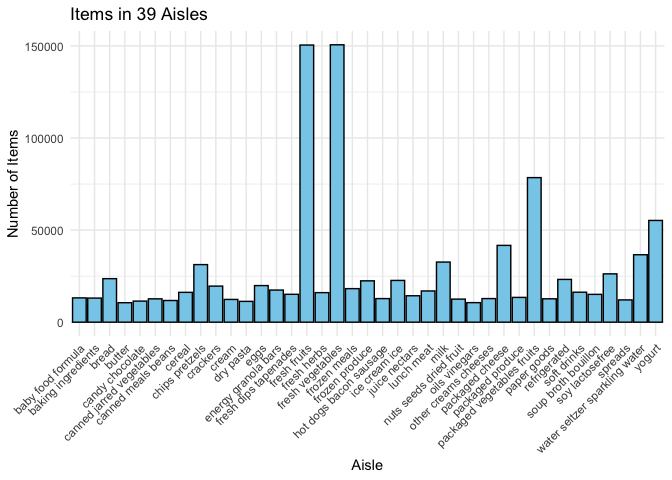

p8105_hw3_md4270
================
Manye Dong
2023-10-07

``` r
library(tidyverse)
```

## Problem 1

``` r
library(p8105.datasets)
data("instacart")
```

``` r
head(instacart)
```

    ## # A tibble: 6 × 15
    ##   order_id product_id add_to_cart_order reordered user_id eval_set order_number
    ##      <int>      <int>             <int>     <int>   <int> <chr>           <int>
    ## 1        1      49302                 1         1  112108 train               4
    ## 2        1      11109                 2         1  112108 train               4
    ## 3        1      10246                 3         0  112108 train               4
    ## 4        1      49683                 4         0  112108 train               4
    ## 5        1      43633                 5         1  112108 train               4
    ## 6        1      13176                 6         0  112108 train               4
    ## # ℹ 8 more variables: order_dow <int>, order_hour_of_day <int>,
    ## #   days_since_prior_order <int>, product_name <chr>, aisle_id <int>,
    ## #   department_id <int>, aisle <chr>, department <chr>

The `instacart` dataset has 1384617 number of rows and 15 number of
columns. Each row is an order placed. Key variables contain the order
id, product id, user id, the order date, product id and the aisle it’s
in. \[giving illustrative examples of observations.\]

``` r
aisle_num = length(unique(instacart$aisle_id))
```

``` r
aisle_most = instacart |>
  group_by(aisle) |>
  summarise(num_products = n()) |>
  arrange(desc(num_products))

aisle_most
```

    ## # A tibble: 134 × 2
    ##    aisle                         num_products
    ##    <chr>                                <int>
    ##  1 fresh vegetables                    150609
    ##  2 fresh fruits                        150473
    ##  3 packaged vegetables fruits           78493
    ##  4 yogurt                               55240
    ##  5 packaged cheese                      41699
    ##  6 water seltzer sparkling water        36617
    ##  7 milk                                 32644
    ##  8 chips pretzels                       31269
    ##  9 soy lactosefree                      26240
    ## 10 bread                                23635
    ## # ℹ 124 more rows

- There are 134 number of aisles, and fresh vegetables is the aisle
  where most items are ordered from.

Make a plot that shows the number of items ordered in each aisle,
limiting this to aisles with more than 10000 items ordered. Arrange
aisles sensibly, and organize your plot so others can read it.

``` r
instacart |>
  group_by(aisle) |>
  summarize(items_num = n()) |>
  filter(items_num > 10000) |>
  arrange(aisle) |>
  ggplot(aes(x=aisle, y=items_num)) +
  geom_bar(stat="identity", fill = "skyblue", color = "black") +
  theme_minimal() +
  theme(axis.text.x = element_text(angle = 45, hjust = 1)) +
  labs(x = "Aisle", y = "Number of Items", title = "Items in 39 Aisles")
```

<!-- -->

Make a table showing the three most popular items in each of the aisles
“baking ingredients”, “dog food care”, and “packaged vegetables fruits”.
Include the number of times each item is ordered in your table.

``` r
instacart |>
  group_by(aisle, product_name) |>
  summarize(count_item = n()) |>
  filter(is.element(aisle, c("baking ingredients", 
                             "dog food care", "packaged vegetables fruits"))) |>
  filter(min_rank(desc(count_item)) < 4) |>
  knitr::kable()
```

    ## `summarise()` has grouped output by 'aisle'. You can override using the
    ## `.groups` argument.

| aisle                      | product_name                                  | count_item |
|:---------------------------|:----------------------------------------------|-----------:|
| baking ingredients         | Cane Sugar                                    |        336 |
| baking ingredients         | Light Brown Sugar                             |        499 |
| baking ingredients         | Pure Baking Soda                              |        387 |
| dog food care              | Organix Chicken & Brown Rice Recipe           |         28 |
| dog food care              | Small Dog Biscuits                            |         26 |
| dog food care              | Snack Sticks Chicken & Rice Recipe Dog Treats |         30 |
| packaged vegetables fruits | Organic Baby Spinach                          |       9784 |
| packaged vegetables fruits | Organic Blueberries                           |       4966 |
| packaged vegetables fruits | Organic Raspberries                           |       5546 |

Make a table showing the mean hour of the day at which Pink Lady Apples
and Coffee Ice Cream are ordered on each day of the week; format this
table for human readers (i.e. produce a 2 x 7 table).

## Problem 2
