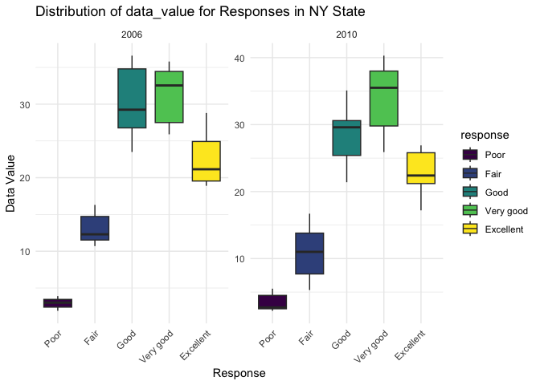

p8105_hw3_md4270
================
Manye Dong
2023-10-07

``` r
library(tidyverse)
```

## Problem 1

``` r
library(p8105.datasets)
data("instacart")
```

``` r
head(instacart)
```

    ## # A tibble: 6 × 15
    ##   order_id product_id add_to_cart_order reordered user_id eval_set order_number
    ##      <int>      <int>             <int>     <int>   <int> <chr>           <int>
    ## 1        1      49302                 1         1  112108 train               4
    ## 2        1      11109                 2         1  112108 train               4
    ## 3        1      10246                 3         0  112108 train               4
    ## 4        1      49683                 4         0  112108 train               4
    ## 5        1      43633                 5         1  112108 train               4
    ## 6        1      13176                 6         0  112108 train               4
    ## # ℹ 8 more variables: order_dow <int>, order_hour_of_day <int>,
    ## #   days_since_prior_order <int>, product_name <chr>, aisle_id <int>,
    ## #   department_id <int>, aisle <chr>, department <chr>

The `instacart` dataset has 1384617 number of rows and 15 number of
columns. Each row is an order placed. Key variables contain the order
id, product id, user id, the order date, product id and the aisle it’s
in. \[giving illustrative examples of observations.\]

``` r
aisle_num = length(unique(instacart$aisle_id))
```

``` r
aisle_most = instacart |>
  group_by(aisle) |>
  summarise(num_products = n()) |>
  arrange(desc(num_products))

aisle_most
```

    ## # A tibble: 134 × 2
    ##    aisle                         num_products
    ##    <chr>                                <int>
    ##  1 fresh vegetables                    150609
    ##  2 fresh fruits                        150473
    ##  3 packaged vegetables fruits           78493
    ##  4 yogurt                               55240
    ##  5 packaged cheese                      41699
    ##  6 water seltzer sparkling water        36617
    ##  7 milk                                 32644
    ##  8 chips pretzels                       31269
    ##  9 soy lactosefree                      26240
    ## 10 bread                                23635
    ## # ℹ 124 more rows

- There are 134 number of aisles, and fresh vegetables is the aisle
  where most items are ordered from.

Make a plot that shows the number of items ordered in each aisle,
limiting this to aisles with more than 10000 items ordered. Arrange
aisles sensibly, and organize your plot so others can read it.

``` r
instacart |>
  group_by(aisle) |>
  summarize(items_num = n()) |>
  filter(items_num > 10000) |>
  arrange(desc(items_num)) |>
  ggplot(aes(x=aisle, y=items_num)) +
  geom_bar(stat="identity", fill = "skyblue", color = "black") +
  theme_minimal() +
  theme(axis.text.x = element_text(angle = 45, hjust = 1)) +
  labs(x = "Aisle", y = "Number of Items", title = "Items in 39 Aisles")
```

<!-- -->

Make a table showing the three most popular items in each of the aisles
“baking ingredients”, “dog food care”, and “packaged vegetables fruits”.
Include the number of times each item is ordered in your table.

``` r
instacart |> 
  filter(aisle %in% c("baking ingredients", "dog food care", "packaged vegetables fruits")) |>
  group_by(aisle) |> 
  count(product_name) |> 
  mutate(rank = min_rank(desc(n))) |> 
  filter(rank < 4) |> 
  arrange(desc(n)) |>
  knitr::kable()
```

| aisle                      | product_name                                  |    n | rank |
|:---------------------------|:----------------------------------------------|-----:|-----:|
| packaged vegetables fruits | Organic Baby Spinach                          | 9784 |    1 |
| packaged vegetables fruits | Organic Raspberries                           | 5546 |    2 |
| packaged vegetables fruits | Organic Blueberries                           | 4966 |    3 |
| baking ingredients         | Light Brown Sugar                             |  499 |    1 |
| baking ingredients         | Pure Baking Soda                              |  387 |    2 |
| baking ingredients         | Cane Sugar                                    |  336 |    3 |
| dog food care              | Snack Sticks Chicken & Rice Recipe Dog Treats |   30 |    1 |
| dog food care              | Organix Chicken & Brown Rice Recipe           |   28 |    2 |
| dog food care              | Small Dog Biscuits                            |   26 |    3 |

Make a table showing the mean hour of the day at which Pink Lady Apples
and Coffee Ice Cream are ordered on each day of the week; format this
table for human readers (i.e. produce a 2 x 7 table).

``` r
instacart |>
  filter(product_name %in% c("Pink Lady Apples", "Coffee Ice Cream")) |>
  group_by(product_name, order_dow) |>
  summarize(mean_hour = mean(order_hour_of_day)) |>
  pivot_wider(
    names_from = order_dow, 
    values_from = mean_hour) |>
  knitr::kable(digits = 2)
```

    ## `summarise()` has grouped output by 'product_name'. You can override using the
    ## `.groups` argument.

| product_name     |     0 |     1 |     2 |     3 |     4 |     5 |     6 |
|:-----------------|------:|------:|------:|------:|------:|------:|------:|
| Coffee Ice Cream | 13.77 | 14.32 | 15.38 | 15.32 | 15.22 | 12.26 | 13.83 |
| Pink Lady Apples | 13.44 | 11.36 | 11.70 | 14.25 | 11.55 | 12.78 | 11.94 |

## Problem 2

``` r
library(p8105.datasets)
data("brfss_smart2010")
```

``` r
head(brfss_smart2010)
```

    ## # A tibble: 6 × 23
    ##    Year Locationabbr Locationdesc      Class Topic Question Response Sample_Size
    ##   <int> <chr>        <chr>             <chr> <chr> <chr>    <chr>          <int>
    ## 1  2010 AL           AL - Jefferson C… Heal… Over… How is … Excelle…          94
    ## 2  2010 AL           AL - Jefferson C… Heal… Over… How is … Very go…         148
    ## 3  2010 AL           AL - Jefferson C… Heal… Over… How is … Good             208
    ## 4  2010 AL           AL - Jefferson C… Heal… Over… How is … Fair             107
    ## 5  2010 AL           AL - Jefferson C… Heal… Over… How is … Poor              45
    ## 6  2010 AL           AL - Jefferson C… Heal… Fair… Health … Good or…         450
    ## # ℹ 15 more variables: Data_value <dbl>, Confidence_limit_Low <dbl>,
    ## #   Confidence_limit_High <dbl>, Display_order <int>, Data_value_unit <chr>,
    ## #   Data_value_type <chr>, Data_Value_Footnote_Symbol <chr>,
    ## #   Data_Value_Footnote <chr>, DataSource <chr>, ClassId <chr>, TopicId <chr>,
    ## #   LocationID <chr>, QuestionID <chr>, RESPID <chr>, GeoLocation <chr>

format the data to use appropriate variable names; focus on the “Overall
Health” topic include only responses from “Excellent” to “Poor” organize
responses as a factor taking levels ordered from “Poor” to “Excellent”

``` r
brfss_smart2010_cleaned = 
  brfss_smart2010 |>
  janitor::clean_names() |>
  rename("state"="locationabbr", "county"="locationdesc") |> 
  filter(topic=="Overall Health" & response %in% c("Excellent", "Very good", "Good", "Fair", "Poor"))
  
brfss_smart2010_cleaned$response = 
  factor(brfss_smart2010_cleaned$response, levels = c("Poor", "Fair", "Good", "Very good", "Excellent"), ordered = TRUE)
  
brfss_smart2010_cleaned
```

    ## # A tibble: 10,625 × 23
    ##     year state county       class topic question response sample_size data_value
    ##    <int> <chr> <chr>        <chr> <chr> <chr>    <ord>          <int>      <dbl>
    ##  1  2010 AL    AL - Jeffer… Heal… Over… How is … Excelle…          94       18.9
    ##  2  2010 AL    AL - Jeffer… Heal… Over… How is … Very go…         148       30  
    ##  3  2010 AL    AL - Jeffer… Heal… Over… How is … Good             208       33.1
    ##  4  2010 AL    AL - Jeffer… Heal… Over… How is … Fair             107       12.5
    ##  5  2010 AL    AL - Jeffer… Heal… Over… How is … Poor              45        5.5
    ##  6  2010 AL    AL - Mobile… Heal… Over… How is … Excelle…          91       15.6
    ##  7  2010 AL    AL - Mobile… Heal… Over… How is … Very go…         177       31.3
    ##  8  2010 AL    AL - Mobile… Heal… Over… How is … Good             224       31.2
    ##  9  2010 AL    AL - Mobile… Heal… Over… How is … Fair             120       15.5
    ## 10  2010 AL    AL - Mobile… Heal… Over… How is … Poor              66        6.4
    ## # ℹ 10,615 more rows
    ## # ℹ 14 more variables: confidence_limit_low <dbl>, confidence_limit_high <dbl>,
    ## #   display_order <int>, data_value_unit <chr>, data_value_type <chr>,
    ## #   data_value_footnote_symbol <chr>, data_value_footnote <chr>,
    ## #   data_source <chr>, class_id <chr>, topic_id <chr>, location_id <chr>,
    ## #   question_id <chr>, respid <chr>, geo_location <chr>

``` r
locations_2002 = 
  brfss_smart2010_cleaned |>
  filter(year==2002) |>
  group_by(state) |>
  summarize(num_location = n_distinct(county)) |>
  filter(num_location >= 7)

head(locations_2002)
```

    ## # A tibble: 6 × 2
    ##   state num_location
    ##   <chr>        <int>
    ## 1 CT               7
    ## 2 FL               7
    ## 3 MA               8
    ## 4 NC               7
    ## 5 NJ               8
    ## 6 PA              10

In 2002, state in the list CT, FL, MA, NC, NJ, PA were observed at 7 or
more locations.

``` r
locations_2010 = 
  brfss_smart2010_cleaned |>
  filter(year==2010) |>
  group_by(state) |>
  summarize(num_location = n_distinct(county)) |>
  filter(num_location >= 7)

locations_2010
```

    ## # A tibble: 14 × 2
    ##    state num_location
    ##    <chr>        <int>
    ##  1 CA              12
    ##  2 CO               7
    ##  3 FL              41
    ##  4 MA               9
    ##  5 MD              12
    ##  6 NC              12
    ##  7 NE              10
    ##  8 NJ              19
    ##  9 NY               9
    ## 10 OH               8
    ## 11 PA               7
    ## 12 SC               7
    ## 13 TX              16
    ## 14 WA              10

In 2010, state CT, FL, MA, NC, NJ, PA were observed at 7 or more
locations.

Construct a dataset that is limited to Excellent responses, and
contains, year, state, and a variable that averages the data_value
across locations within a state.

``` r
avg_values = 
brfss_smart2010_cleaned |>
  filter(response=="Excellent") |>
  select(-county) |>
  group_by(year, state) |>
  mutate(avg_data_value = mean(data_value, na.rm = TRUE)) |>
  select(year, state, avg_data_value)
  
avg_values
```

    ## # A tibble: 2,125 × 3
    ## # Groups:   year, state [443]
    ##     year state avg_data_value
    ##    <int> <chr>          <dbl>
    ##  1  2010 AL              18.4
    ##  2  2010 AL              18.4
    ##  3  2010 AL              18.4
    ##  4  2010 AZ              21.6
    ##  5  2010 AZ              21.6
    ##  6  2010 AZ              21.6
    ##  7  2010 AR              25.4
    ##  8  2010 AR              25.4
    ##  9  2010 AR              25.4
    ## 10  2010 CA              23.9
    ## # ℹ 2,115 more rows

Make a “spaghetti” plot of this average value over time within a state
(that is, make a plot showing a line for each state across years – the
geom_line geometry and group aesthetic will help).

``` r
ggplot(avg_values, aes(x = year, y = avg_data_value, color = state, group = state)) +
  geom_line() +
  labs(x = "Year", y = "Average Value", title = "Spaghetti Plot of Average Values Over Time by State") +
  theme_minimal()
```

<!-- -->

Make a two-panel plot showing, for the years 2006, and 2010,
distribution of data_value for responses (“Poor” to “Excellent”) among
locations in NY State.

``` r
ny_data = brfss_smart2010_cleaned |>
filter(brfss_smart2010_cleaned$state == "NY" 
       & brfss_smart2010_cleaned$year %in% c(2006, 2010))
```

``` r
ggplot(ny_data, aes(x = response, y = data_value, fill = response)) +
  geom_boxplot() +
  facet_wrap(~year, scales = "free_y") +
  labs(title = "Distribution of data_value for Responses in NY State",
       y = "Data Value",
       x = "Response") +
  theme_minimal()
```

<!-- -->
